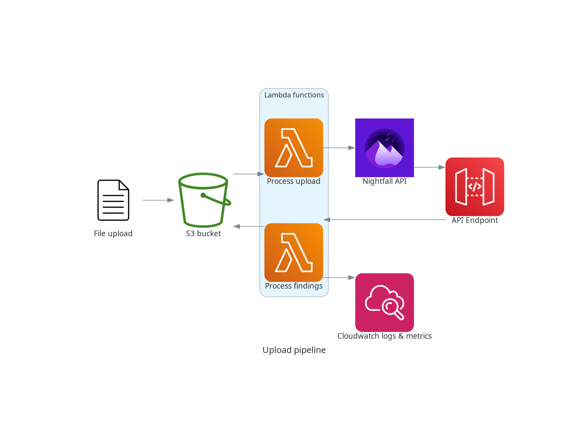
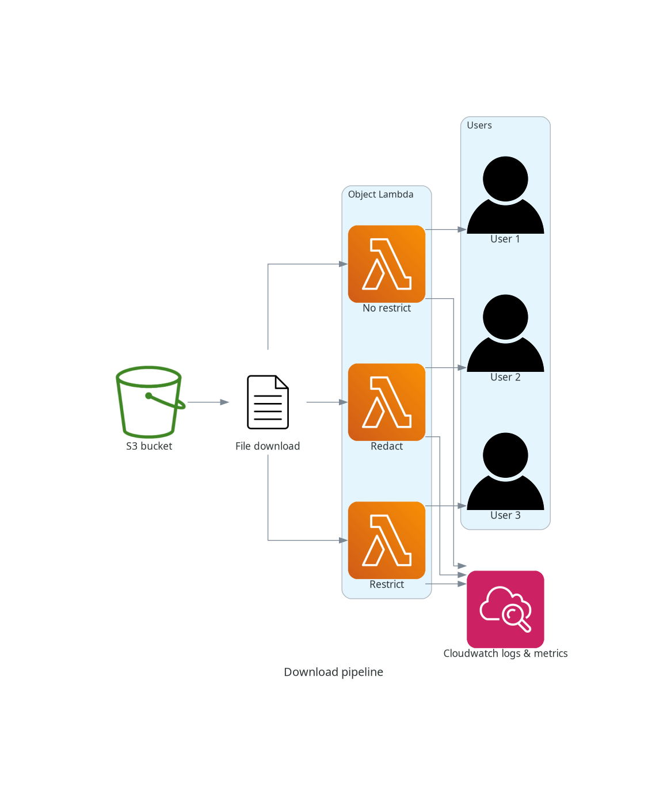
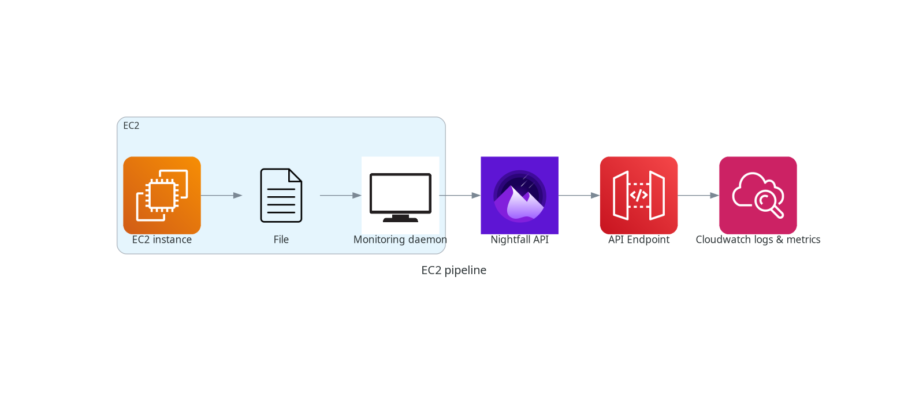

# Mini DLP

A collection of different Python scripts, used to attach to AWS Lambda functions to monitor, detect and process sensitive data in files and documents.

This is a basic, barebones implementation of a DLP (Data Loss Prevention) solution on a cloud platform.

Uses the [Nightfall AI platform](https://www.nightfall.ai/) as the detector.

## Features

- Automatically detect files uploaded to an S3 bucket or in an EC2 instance
- Log the findings and publish metrics in CloudWatch
- Can be integrated with other AWS services, such as SNS for alerts.

## Workflows

### Upload pipeline

### Download pipeline

### EC2 pipeline

